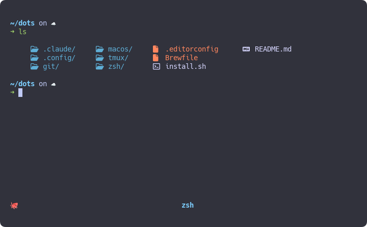

## dotfiles

Dotfiles for my macos setup.



- Terminal: [Wezterm](https://wezterm.org/) using zsh with [starship](https://starship.rs/) and [color-ls](https://github.com/athityakumar/colorls)
- Editor: [neovim](https://neovim.io/) with [vim-plug](https://github.com/junegunn/vim-plug)
- Tools: [tmux](https://github.com/tmux/tmux), [zoxide](https://github.com/ajeetdsouza/zoxide), [stow](https://www.gnu.org/software/stow/)

## Installation

```bash
./install.sh
```
